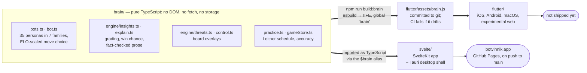
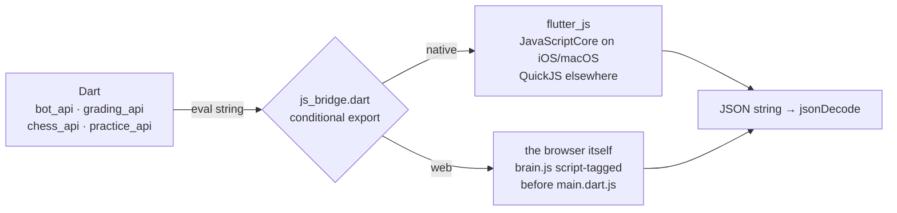
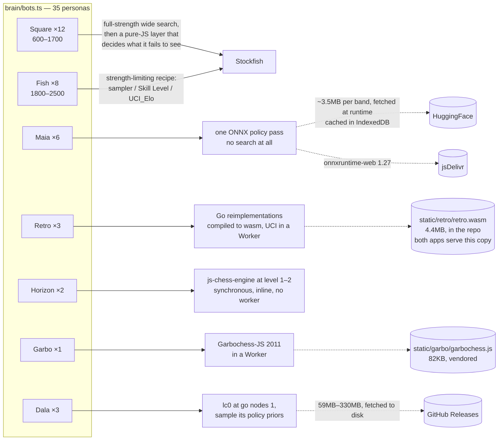
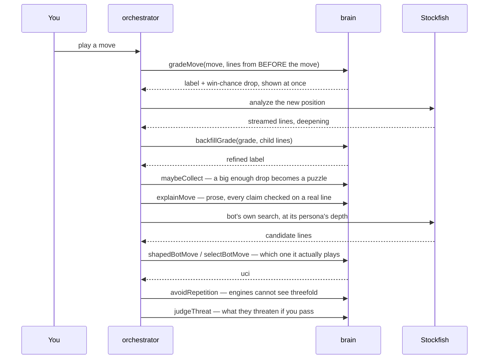
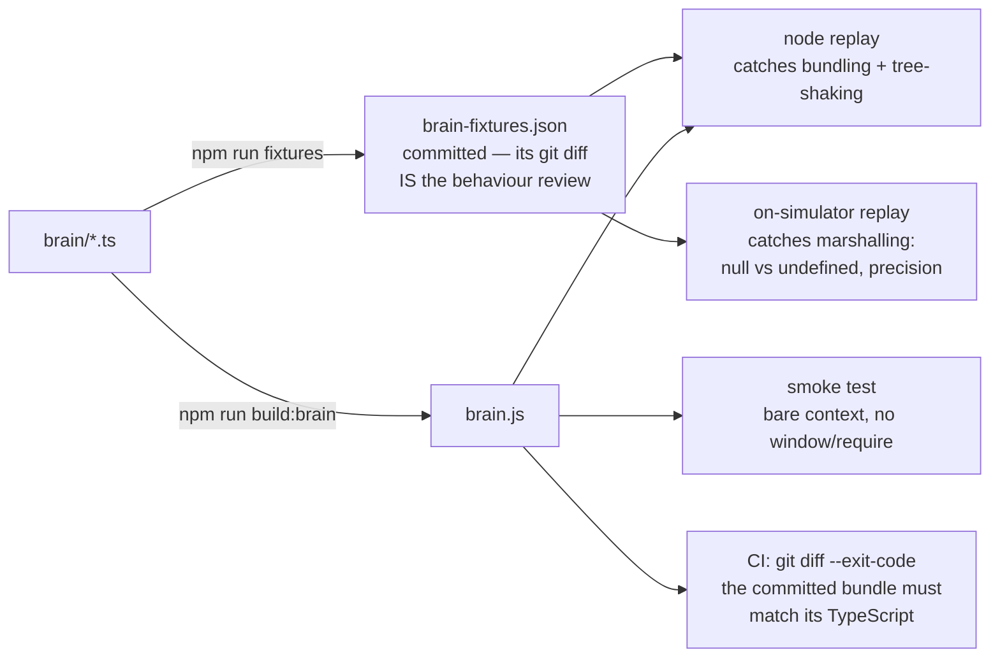

# Architecture

Two apps, one brain. This document is the map: what lives where, which engine
actually computes each bot's move, and what crosses which boundary.

## One brain, two apps

Everything that decides *anything* — which move a bot plays, what a move is
worth, what the prose says, when a puzzle is due — lives in `brain/` as plain
TypeScript. Nothing reachable from `brain/brain-entry.ts` may touch the DOM,
the network, or storage: the host supplies engine searches, persistence and
HTTP. That constraint is what lets the same code run unmodified inside a
browser, inside JavaScriptCore on an iPhone, and inside Node during CI.



The two apps never import each other. The Svelte app compiles the brain's
TypeScript directly; the Flutter app consumes a built bundle. Same source,
two delivery mechanisms.

### How the brain crosses into Dart

There is no code generation and no RPC. Dart builds a JavaScript expression,
evaluates it, and parses the JSON that comes back:

```
JSON.stringify(brain.fn(<jsonEncode(arg)>, …) ?? null)
```

Both hosts evaluate the *identical string* (`brain/js_bridge_shared.dart`),
which is what makes a golden fixture mean the same thing on either one.



The split exists because the two halves cannot share a base class: the native
side can't import `dart:js_interop` and the web side can't import `dart:ffi`.
A `BRAIN_VERSION` constant is asserted on both hosts at boot, so a stale
bundle fails loudly with the command that fixes it rather than misbehaving
subtly.

Two marshalling details that have bitten before, both now load-bearing:
Dart `null` and JS `undefined` are different on the wire (a `kOmit` sentinel
exists to send genuine `undefined` and engage the brain's own defaults), and
`Infinity` cannot cross JSON — mate is signalled as null.

**The bridge is synchronous, and that is not a detail.** One eval in, one JSON
string out — so a function returning a Promise crosses as `{}`. *Anything
async is simply not expressible through it.* That single fact decides which
bot families the Flutter app can offer: Horizon is a synchronous ~3ms call and
so it just works, while Maia, Retro and Garbo are all asynchronous by nature
(a neural net, a wasm worker, a postMessage protocol) and each needs its own
mechanism on the Dart side before it can play. It is also why anything that
would block for a noticeable time cannot use the bridge as-is: these calls run
on the UI isolate.

## Where each persona gets its move

This is the part the roster hides. Seven families, and *every one of them
computes its move by a different mechanism*. Three need nothing but
JavaScript; three download weights at runtime; one needs a native binary.



Maia and Dala weights are GPL-3.0, which is why they are fetched at runtime
and never redistributed in the repo or the app bundle.

Two consequences worth knowing before touching any of this:

**Square's weakening is not in the search.** The engine always searches at
full strength for a Square; a separate pure-JS choice layer decides which
tactics that persona fails to notice. That is why Squares can be recalibrated
without re-running an engine, and why their labels are only valid against the
exact engine build they were measured on.

**Everything except Square and Fish is fallible.** Each of the other five can
fail — a blocked CDN, an unreachable model host, a browser that cannot run
ort-web — and each falls back to Stockfish at the persona's internal ELO. The
fallback sets a flag the UI surfaces, because a silent stand-in would corrupt
the player-rating fit.

## Which Stockfish, on which platform

The same UCI protocol, five different ways of speaking it:

| Platform | Transport | Binary |
|---|---|---|
| Web (Svelte) | Web Worker | Stockfish 18 **lite-single**, `static/wasm/` |
| Desktop (Tauri) | sidecar child process | native Stockfish, full NNUE, all cores |
| iOS / Android | **FFI**, `package:stockfish` | Stockfish 16, full NNUE |
| Flutter desktop | child process | whatever binary it finds on the system |
| Flutter web | Web Worker | the same lite-single build, staged from `static/` |

"lite-single" is load-bearing rather than incidental. Single-threaded means no
`SharedArrayBuffer`, which means no COOP/COEP headers, which is what lets the
site be a plain static deploy *and* lets Maia's ONNX runtime work alongside
it. Every persona label was calibrated against that exact build — so the
mobile FFI engine (a different Stockfish, at full strength on real cores) is a
known calibration gap, documented in-source, not an oversight.

## A move, end to end

The subtle part is that a move is graded twice. The first grade compares it
against the analysis of the position *before* it was played; that lands
immediately. The engine then searches the resulting position, and that search
refines the same grade — a "backfill" — before the label is trusted enough to
mine a puzzle from it.



`avoidRepetition` is at the choice layer rather than in an engine because an
engine only ever receives a bare FEN, and a FEN cannot express that a position
has occurred twice before.

### One ordering rule, enforced two different ways

The threat probe must never interrupt a bot's search. The bot's search
parameters *are* its rating; stopping it early makes it play above or below
its label, which corrupts the calibration the whole roster depends on.

The two apps enforce this with genuinely different machinery, and a change to
one does not carry to the other:

- **Svelte** has a single-slot supersede queue and a hand-placed guard: the
  threat probe returns early when a bot reply is pending.
- **Flutter** has a four-level preempting priority queue
  (`botMove > practiceCheck > threatProbe > analysis`) plus a "sprint" wait —
  the bot pauses up to 1.5s for your move's analysis to reach depth 10 before
  preempting it, so your grade appears while the bot appears to think.

## Storage

Nothing leaves the device. There is no server, no account, no API key.

| | Web / Tauri | Flutter |
|---|---|---|
| Finished games | IndexedDB `botvinnik` | sqflite, JSON documents |
| Analysis cache | IndexedDB, 20k positions | none yet — in-memory only |
| Practice items | `localStorage`, one JSON array | sqflite `kv` table |
| Settings | `localStorage` | `shared_preferences` |
| Maia weights | IndexedDB | n/a |

The two use the same record shapes and the same `botvinnik-*` setting keys on
purpose, so an export from one imports into the other as close to
pass-through as possible. On Flutter web, sqflite runs against sqlite3
compiled to wasm, which itself persists into IndexedDB.

## What keeps the two apps honest

The brain is shared, but the *hosts* are not, so a bug can hide in the seam
between them. Four guards, cheapest first:



Fixtures record engine lines as *inputs*, so they pin logic rather than
search: they stay valid across engine versions and cannot fail for the boring
reason that Stockfish found a different move this week.

CI runs four jobs: type-check plus unit tests, Playwright end-to-end against a
real build, the `vendor/dartchess` fork's own suite (native and web), and the
Flutter job — which builds the brain, asserts the committed bundle matches,
then builds Flutter web, because that is the only thing that type-checks the
web branch of every conditional import.

## Known gaps

- **The roster gap is closed on the web** (2026-07-19). The brain ships 35
  personas; Flutter web offers **32**, which is parity — Dala needs a native
  lc0 sidecar and is desktop-only in *both* apps. Native Flutter still offers
  22.

  The way it closed is the interesting part: **none of the last three families
  uses the brain bridge at all.** Retro, Garbo and Maia are Workers, so their
  Dart clients talk to them directly and the synchronous bridge never enters
  into it. The bridge is a constraint only on work that has to go *through the
  brain* — which is why the "everything left is async and the bridge is not"
  framing turned out to be the wrong way to see the problem.

  Maia does still share code with the brain, but by a different route: its
  encoding and decoding are pure functions over a FEN history, so they live in
  `brain/maia/` and are imported by both apps' workers rather than called
  across the bridge.

  The web/native split is real: all three need a Web Worker, so `.supported`
  is false on macOS/iOS and the roster picker does not offer those ten there.
  Each `*_engine_io.dart` documents what its native path would cost — retro is
  scoped and measured, Maia is the most tractable (the `onnxruntime` pub
  package needs no runtime port), Garbo is the awkward one despite being plain
  JavaScript.
- **Only JavaScriptCore has ever run the brain.** `ios/` and `macos/` are the
  only native targets that exist; QuickJS is the runtime on Android and is
  untested. Bundling js-chess-engine put BigInt literals in `brain.js`, and
  QuickJS gates BigInt behind `CONFIG_BIGNUM` — a build without it fails to
  *parse* the bundle, so the app would not boot at all rather than lose one
  bot family. Verify before adding an Android target.
- **Calibration drift on native engines.** Labels were measured against
  lite-single WASM; mobile FFI and desktop sidecars are different engines. The
  desktop Square knots are known stale and documented as such in-source.
- **Dala is desktop-only** and needs an lc0 binary whose provisioning is not
  scripted the way Stockfish's is.
