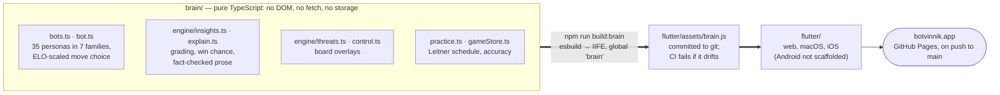
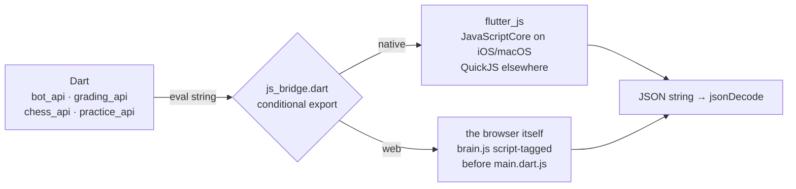
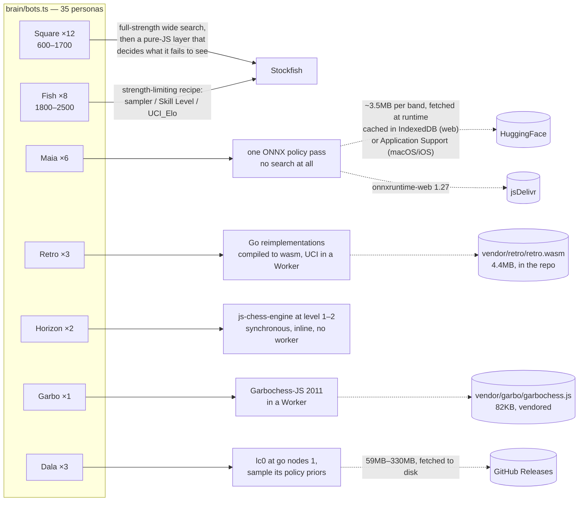
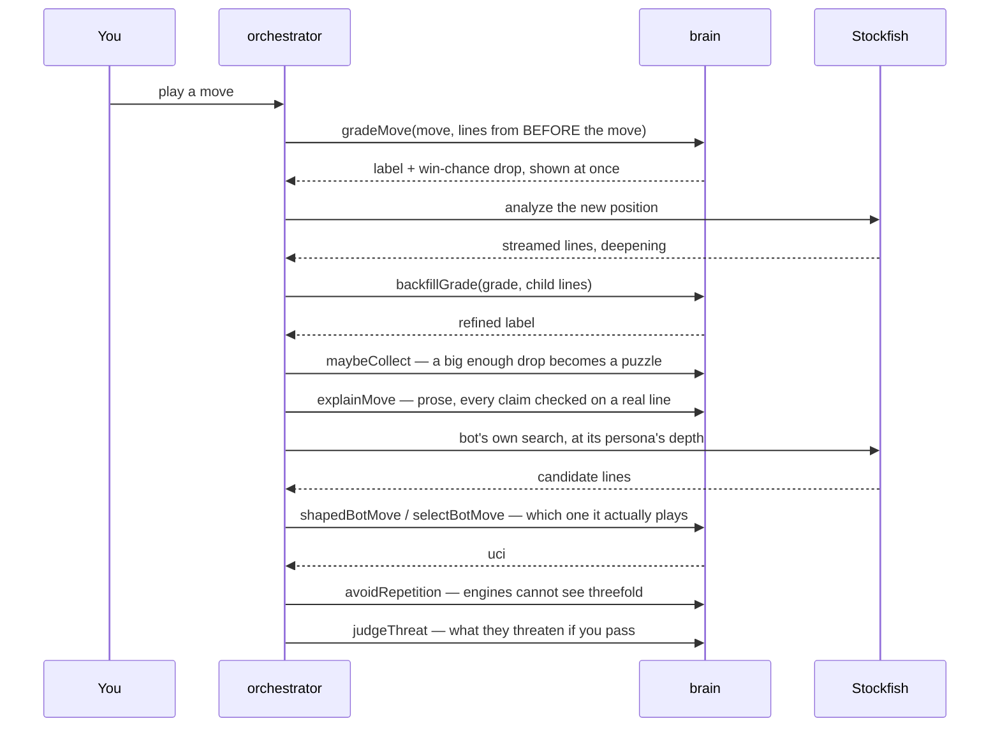

# Architecture

Two apps, one brain. This document is the map: what lives where, which engine
actually computes each bot's move, and what crosses which boundary.

## One brain, two apps

Everything that decides *anything* — which move a bot plays, what a move is
worth, what the prose says, when a puzzle is due — lives in `brain/` as plain
TypeScript. Nothing reachable from `brain/brain-entry.ts` may touch the DOM,
the network, or storage: the host supplies engine searches, persistence and
HTTP. That constraint is what lets the same code run unmodified inside a
browser, inside JavaScriptCore on an iPhone, and inside Node during CI.



The brain does not import the app, and that is the point: it is pure
TypeScript with no DOM, no fetch and no storage, so it can be unit-tested in
node, replayed as golden fixtures, and driven headless by the calibration gym
in `scripts/` — none of which involve the app at all.

It was shared by two apps until 2026-07-20; the SvelteKit app compiled it
directly while Flutter consumed the bundle. That app is retired (tag
`svelte-eol`), but the separation it forced is why the brain is still
independently testable, and why the gym can measure a persona without
rendering anything.

### How the brain crosses into Dart

There is no code generation and no RPC. Dart builds a JavaScript expression,
evaluates it, and parses the JSON that comes back:

```
JSON.stringify(brain.fn(<jsonEncode(arg)>, …) ?? null)
```

Both hosts evaluate the *identical string* (`brain/js_bridge_shared.dart`),
which is what makes a golden fixture mean the same thing on either one.



The split exists because the two halves cannot share a base class: the native
side can't import `dart:js_interop` and the web side can't import `dart:ffi`.
A `BRAIN_VERSION` constant is asserted on both hosts at boot, so a stale
bundle fails loudly with the command that fixes it rather than misbehaving
subtly.

Two marshalling details that have bitten before, both now load-bearing:
Dart `null` and JS `undefined` are different on the wire (a `kOmit` sentinel
exists to send genuine `undefined` and engage the brain's own defaults), and
`Infinity` cannot cross JSON — mate is signalled as null.

**The bridge is synchronous, and that is not a detail.** One eval in, one JSON
string out — so a function returning a Promise crosses as `{}`. *Anything
async is simply not expressible through it.* That single fact decides which
bot families the Flutter app can offer: Horizon is a synchronous ~3ms call and
so it just works, while Maia, Retro and Garbo are all asynchronous by nature
(a neural net, a wasm worker, a postMessage protocol) and each needs its own
mechanism on the Dart side before it can play. It is also why anything that
would block for a noticeable time cannot use the bridge as-is: these calls run
on the UI isolate.

## Where each persona gets its move

This is the part the roster hides. Seven families, and *every one of them
computes its move by a different mechanism*. Three need nothing but
JavaScript; three download weights at runtime; one needs a native binary.



Maia and Dala weights are GPL-3.0, which is why they are fetched at runtime
and never redistributed in the repo or the app bundle.

Two consequences worth knowing before touching any of this:

**Square's weakening is not in the search.** The engine always searches at
full strength for a Square; a separate pure-JS choice layer decides which
tactics that persona fails to notice. That is why Squares can be recalibrated
without re-running an engine, and why their labels are only valid against the
exact engine build they were measured on.

**Everything except Square and Fish is fallible.** Each of the other five can
fail — a blocked CDN, an unreachable model host, a browser that cannot run
ort-web — and each falls back to Stockfish at the persona's internal ELO. The
fallback sets a flag the UI surfaces, because a silent stand-in would corrupt
the player-rating fit.

## Which Stockfish, on which platform

The same UCI protocol, five different ways of speaking it:

| Platform | Transport | Binary |
|---|---|---|
| Web | Web Worker | Stockfish 18 **lite-single**, `vendor/wasm/`, staged into the build |
| iOS | **FFI**, `package:stockfish` | Stockfish 16, full NNUE |
| macOS | child process | the binary bundled in `Contents/MacOS`, else one on the system |

"lite-single" is load-bearing rather than incidental. Single-threaded means no
`SharedArrayBuffer`, which means no COOP/COEP headers, which is what lets the
site be a plain static deploy *and* lets Maia's ONNX runtime work alongside
it. Every persona label was calibrated against that exact build — so the
mobile FFI engine (a different Stockfish, at full strength on real cores) is a
known calibration gap, documented in-source, not an oversight.

## A move, end to end

The subtle part is that a move is graded twice. The first grade compares it
against the analysis of the position *before* it was played; that lands
immediately. The engine then searches the resulting position, and that search
refines the same grade — a "backfill" — before the label is trusted enough to
mine a puzzle from it.



`avoidRepetition` is at the choice layer rather than in an engine because an
engine only ever receives a bare FEN, and a FEN cannot express that a position
has occurred twice before.

### One ordering rule, enforced two different ways

The threat probe must never interrupt a bot's search. The bot's search
parameters *are* its rating; stopping it early makes it play above or below
its label, which corrupts the calibration the whole roster depends on.

The arbiter enforces it with a four-level preempting priority queue
(`botMove > practiceCheck > threatProbe > analysis`) plus a "sprint" wait — the
bot pauses up to 1.5s for your move's analysis to reach depth 10 before
preempting it, so your grade appears while the bot appears to think.

(The retired Svelte app did the same job with a single-slot supersede queue and
a hand-placed guard. Two mechanisms for one invariant was exactly the cost of
two apps.)

## Storage

Nothing leaves the device. There is no server, no account, no API key.

| | Where |
|---|---|
| Finished games | sqflite, JSON documents |
| Analysis cache | none yet — in-memory only |
| Practice items | sqflite `kv` table |
| Settings | `shared_preferences` |
| Maia weights | IndexedDB on web; a file under Application Support on macOS/iOS |

The record shapes and the `botvinnik-*` setting keys are the ones the Svelte
app used, deliberately: they were kept pass-through compatible while both
apps existed, and there is no reason to churn them now that one does.

On web, sqflite runs against sqlite3 compiled to wasm, which itself persists
into IndexedDB.

## What keeps the two apps honest

The brain is shared, but the *hosts* are not, so a bug can hide in the seam
between them. Four guards, cheapest first:

```mermaid
flowchart LR
    SRC["brain/*.ts"] -->|"npm run fixtures"| FIX["brain-fixtures.json<br/>committed — its git diff<br/>IS the behaviour review"]
    SRC -->|"npm run build:brain"| BUN["brain.js"]
    BUN --> SMOKE["smoke test<br/>bare context, no window/require"]
    FIX --> NODE["node replay<br/>catches bundling + tree-shaking"]
    BUN --> NODE
    FIX --> DEV["on-simulator replay<br/>catches marshalling:<br/>null vs undefined, precision"]
    BUN --> CI["CI: git diff --exit-code<br/>the committed bundle must<br/>match its TypeScript"]
```



Fixtures record engine lines as *inputs*, so they pin logic rather than
search: they stay valid across engine versions and cannot fail for the boring
reason that Stockfish found a different move this week.

CI runs four jobs: type-check plus unit tests, Playwright end-to-end against a
real build, the `vendor/dartchess` fork's own suite (native and web), and the
Flutter job — which builds the brain, asserts the committed bundle matches,
then builds Flutter web, because that is the only thing that type-checks the
web branch of every conditional import.

## Known gaps

- **The roster gap is closed on the web** (2026-07-19). The brain ships 35
  personas; Flutter web offers **32**, which is parity — Dala needs a native
  lc0 sidecar and is desktop-only in *both* apps. **Native Flutter now offers
  the same 32**, closed over 2026-07-19/20: retro as spawned binaries on macOS
  and a Go c-archive on iOS, Maia over FFI on both, and Garbo in a background
  isolate. Nothing is web-only any more.

  The way it closed is the interesting part: **none of the last three families
  uses the brain bridge at all.** Retro, Garbo and Maia are Workers, so their
  Dart clients talk to them directly and the synchronous bridge never enters
  into it. The bridge is a constraint only on work that has to go *through the
  brain* — which is why the "everything left is async and the bridge is not"
  framing turned out to be the wrong way to see the problem.

  Maia does still share code with the brain, but by a different route: its
  encoding and decoding are pure functions over a FEN history, so they live in
  `brain/maia/` and are imported by both apps' workers rather than called
  across the bridge. Native Maia takes that route one step further — the same
  two functions are bundled to `assets/maia-brain.js` and run in an embedded
  JS runtime of their own, so a move is encode-in-JS, infer-in-Dart,
  decode-in-JS. A *second* bundle rather than two more exports on `brain.js`,
  because brain.js is a `<script>` tag on the web and lc0's policy index is
  1858 strings only a Maia ever reads.

  The web/native split is real, and now finer than a single number. Retro no
  longer needs its Web Worker on macOS: the morlock engines build to native
  UCI binaries (`stage-macos-engines.sh`), get copied into the app bundle, and
  `retro_engine_io.dart` spawns them as child processes — its own, never the
  arbiter's, and reading only `bestmove`, the same two invariants the web
  client holds.

  iOS has no child processes at all, so it builds the *same* Go source with
  `-buildmode=c-archive` and drives it over `dart:ffi`
  (`scripts/retro-ffi/main.go`, `retro_engine_ffi.dart`). One archive covers
  all three engines, selected by name, and `RetroEngine` is only the choice
  between the two transports. Three transports, one `build()` switch shared
  with the wasm entry — which is what lets the calibration mean the same thing
  on all of them.

  `RetroEngine.supported` gates on the engine actually being reachable — a
  staged binary on macOS, a linked symbol on iOS — so a build that skipped
  staging simply doesn't offer retro rather than offering it and falling
  back.

  Garbo closed last and most cheaply, which was not the expectation: the
  stub had it down as the hardest of the three. It is 2011 JavaScript written
  as a Worker, and the two things it needs turn out to be seven lines of shim
  (`self` to assign `onmessage` to, a `postMessage` that appends to an array)
  and a background isolate — because its search is one long SYNCHRONOUS call,
  so everything it emits is already buffered by the time the call returns.
  There is no message loop to get right. `flutter_js`'s JavaScriptCore path is
  pure `dart:ffi` with no root-isolate dependency, so it starts fine off the
  main isolate; the engine source is read on the main isolate (rootBundle only
  exists there) and passed across as a string.

  Maia closed the same way, without a Worker anywhere: `package:onnxruntime`
  is ORT's C API over `dart:ffi`, so there was no runtime to port, and its
  isolate session keeps the forward pass off the UI thread. What that buys is
  checkable rather than assumed — `integration_test/maia_native_test.dart`
  asserts the native path returns the move the *web* returns, for three bands
  and four positions, against fixtures emitted from the node reference.

  What is left is Dala, which waits on the lc0 sidecar (#45), and Android,
  which waits on someone checking QuickJS can parse the bundles at all (#46).

  Native Maia is also the first thing in the app to open a socket, so the
  macOS bundle now carries `com.apple.security.network.client`. Everything
  else on native is offline by construction, and this stays a single host
  reached only when someone picks a Maia.
- **Android needs JavaScriptCore, not QuickJS** (measured 2026-07-20, #46).
  The worry was real and its attribution was wrong. `brain.js` holds ~145
  BigInt literals and `maia-brain.js` ~13, but they do not come from
  js-chess-engine — they come from **chess.js**, which uses 64-bit arithmetic
  for Zobrist hashing. Nothing can be dropped to avoid it.

  The QuickJS that `flutter_js` ships for Android
  (`fastdev-jsruntimes-quickjs` 0.3.6) is built **without `CONFIG_BIGNUM`**:
  its atom table has `Object`, `Proxy`, `Symbol`, `Promise` and every typed
  array, and no `BigInt`, `bigint` or `asIntN` at all. Both bundles fail there
  with `SyntaxError: invalid number literal` — a *parse* error, so the app
  would not boot rather than lose a bot family. The same bundles evaluate
  cleanly under the same QuickJS built *with* `CONFIG_BIGNUM`, which is the
  A/B that pins it on the runtime rather than on us.

  The route is `flutter_js`'s own `forceJavascriptCoreOnAndroid: true`, plus
  the `fastdev-jsruntimes-jsc` AAR that the package leaves commented out in
  its gradle. That build does carry `BigInt`. It costs ~9MB per ABI against
  QuickJS's ~1MB, and buys something worth having: one JS engine on every
  platform, so the brain cannot behave differently on Android than it does
  everywhere else. Unverified until there is an Android target to run it on.
- **Calibration drift on native engines.** Labels were measured against
  lite-single WASM; mobile FFI and desktop sidecars are different engines. The
  desktop Square knots are known stale and documented as such in-source.
- **Dala is desktop-only** and needs an lc0 binary whose provisioning is not
  scripted the way Stockfish's is.
