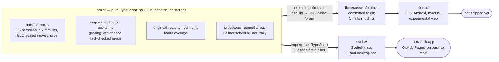

# Botvinnik

A personal chess practice app — play, get graded, collect your mistakes, and drill them as puzzles. Everything runs in the browser: no server, no accounts, no API keys.

Ported and distilled from a fork of [en-croissant](https://github.com/franciscoBSalgueiro/en-croissant) into a minimal SvelteKit app.

## Features

- **Engine analysis** — Stockfish 18 (lite WASM build) as a web worker, MultiPV 5, with an IndexedDB analysis cache (revisited positions grade in ~70ms instead of ~2s)
- **Move insights** — every move graded against the engine's best: eval, %-of-best, win-chance delta, chess.com-style labels (brilliant → blunder), and fact-based prose explanations (detected mates, hanging pieces, forks, material over a quoted line — never an unverified claim)
- **Lines Tree** — a persistent SVG graph of engine lines explored during the game; y-axis/color/label switchable between eval, win %, %-best, and confidence
- **Line previews** — hover any engine line or best-move reference for a small board that animates through the line
- **Practice mode** — moves that drop ≥N% win chance are collected automatically and replayed as puzzles on a Leitner spaced-repetition schedule
- **Bot opponents** — 35 personas from 550 to 2500, in seven families that each play by a genuinely different mechanism: Stockfish shaped to miss the tactics a player at that rating would miss, Stockfish weakened by recipe, Maia's human-imitation neural nets, Go ports of the 1950s paper engines (TUROCHAMP, BERNSTEIN, SARGON), a tiny JavaScript engine that can't see past its own exchanges, a 2011 JavaScript engine, and lc0 policy sampling on the desktop. See [ARCHITECTURE.md](ARCHITECTURE.md#where-each-persona-gets-its-move)
- **Game review** — finished games auto-save to IndexedDB with PGN, per-move grades, and explanations; reviewable move-by-move
- **Lichess import** — pull any user's server-analysed games straight into the archive: labels, accuracies and practice puzzles are mined from Lichess's own evals, no local engine time
- **YouTube commentary** — positions matched against ~27k human commentary snippets mined from game-review videos ([Kaggle dataset](https://www.kaggle.com/datasets/huberthamelin/chess-reviews-from-youtube)), with timestamped links to the source video
- **Blind mode**, promotion picker, refutation arrows

See [ROADMAP.md](ROADMAP.md) for what's planned next.

## Layout

Two apps, one brain. Neither app depends on the other.



**[ARCHITECTURE.md](ARCHITECTURE.md)** is the full map: which engine backs each
persona and where its weights come from, which Stockfish runs on which
platform, how the brain crosses into Dart, and what a single move does
end to end.

```
brain/      the shared truth: bot move selection, grading, explanations,
            practice scheduling — pure TypeScript, no DOM, no framework.
            The Svelte app imports it as $brain; the Flutter app bundles it
            to flutter/assets/brain.js (npm run build:brain) and runs the
            same code in an embedded JS engine.
svelte/     the SvelteKit web app (botvinnik.app) and its Tauri desktop shell
flutter/    the Flutter app — iOS, Android, macOS, and an experimental web build
static/     web assets both apps serve: the Stockfish WASM engine, the baked
            opening book, icons
scripts/    shared tooling: the brain bundle, golden fixtures, book building
vendor/     forks we maintain (see each FORK.md)
```

`build/` is the Svelte app's output, which is what deploys to botvinnik.app.

## Development

```sh
npm install
npm run dev
```

`npm run check` type-checks. Playwright (against installed Chrome) is used for end-to-end verification scripts.

## Desktop app (Tauri)

The same app ships as a desktop shell with a native Stockfish sidecar —
full-strength NNUE on all cores instead of the single-threaded WASM build,
plus a background archive analyzer. Requires Rust and a stockfish binary:

```sh
brew install stockfish   # or apt-get install stockfish
npm run tauri:setup      # stages the sidecar binary (gitignored)
npx tauri dev            # or: npx tauri build
```

Stockfish is GPL-3.0 and runs as a separate sidecar process; bundles that
include the binary must comply with its license (source: stockfishchess.org).

## Static build / deploy

The app is fully client-side, so `npm run build` (adapter-static) emits a plain HTML/JS bundle in `build/` that runs on any static file host — `npx serve build` works; `file://` does not (workers and fetch need HTTP).

Pushes to `main` deploy to GitHub Pages via `.github/workflows/pages.yml`, which builds with `BASE_PATH=/botvinnik` for the project-site URL. All asset URLs go through SvelteKit's `base`, so builds without `BASE_PATH` serve from the domain root.

## Commentary data

`static/commentary.json` is derived from the CC BY-NC [chess-reviews-from-youtube](https://www.kaggle.com/datasets/huberthamelin/chess-reviews-from-youtube) dataset (non-commercial use only). To regenerate, download the dataset to `data/kaggle.huberthamelin.chess-reviews-from-youtube/` and run:

```sh
python3 scripts/build-commentary.py
```
