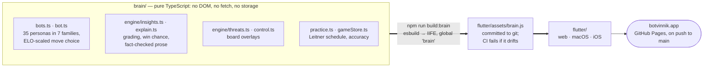

# Botvinnik

A personal chess practice app — play, get graded, collect your mistakes, and drill them as puzzles. Everything runs on your device: no server, no accounts, no API keys.

Live at [botvinnik.app](https://botvinnik.app), and the same app builds for macOS and iOS.

It began as a SvelteKit app distilled from a fork of [en-croissant](https://github.com/franciscoBSalgueiro/en-croissant). That app shipped the site until 2026-07-19 and was retired on 2026-07-20 — it is preserved whole at the [`svelte-eol`](../../releases/tag/svelte-eol) tag, and what survived it is `brain/`.

## Features

- **Engine analysis** — Stockfish, MultiPV 5: a WASM worker on the web, FFI on iOS, a spawned process on macOS
- **Move insights** — every move graded against the engine's best: eval, %-of-best, win-chance delta, chess.com-style labels (brilliant → blunder), and fact-based prose explanations (detected mates, hanging pieces, forks, material over a quoted line — never an unverified claim)
- **Lines Tree** — a persistent graph of the engine lines explored during the game
- **Board overlays** — threat and win rings, square control, refutation arrows, under a three-fact rule so the board never shouts
- **Practice mode** — moves that drop ≥N% win chance are collected automatically and replayed as puzzles on a Leitner spaced-repetition schedule
- **Bot opponents** — 35 personas in seven families that each play by a genuinely different mechanism: Stockfish shaped to miss the tactics a player at that rating would miss, Stockfish weakened by recipe, Maia's human-imitation neural nets, Go ports of the 1950s paper engines (TUROCHAMP, BERNSTEIN, SARGON), a tiny JavaScript engine that can't see past its own exchanges, a 2011 JavaScript engine, and lc0 policy sampling. 32 of them play on the web, macOS and iOS; the Dala three need a native lc0 sidecar. See [ARCHITECTURE.md](ARCHITECTURE.md#where-each-persona-gets-its-move)
- **Game review** — finished games save with PGN, per-move grades and explanations, reviewable move by move
- **PGN import** — paste a game and it is archived and opened in Review
- **Blind mode**, start-from-FEN, keyboard shortcuts throughout

See [ROADMAP.md](ROADMAP.md) for what's planned next, and [CHANGELOG.md](CHANGELOG.md) for what has landed.

## Layout

One app, one brain — and a brain that is deliberately separable from it.



**[ARCHITECTURE.md](ARCHITECTURE.md)** is the full map: which engine backs each
persona and where its weights come from, which Stockfish runs on which
platform, how the brain crosses into Dart, and what a single move does
end to end.

```
brain/      the shared truth: bot move selection, grading, explanations,
            practice scheduling — pure TypeScript, no DOM, no framework.
            The app bundles it to flutter/assets/brain.js
            (npm run build:brain) and runs it in an embedded JS engine.
flutter/    the app — web, macOS, iOS
vendor/     third-party code we carry: the Stockfish WASM build, the retro
            engines, Garbochess, and our dartchess fork (see each FORK.md)
scripts/    tooling and research: the brain bundle, golden fixtures, the
            calibration gym, the SquareFish lichess bot
docs/       submission notes, desktop notes, design decisions
```

## Development

```sh
npm install          # the brain's toolchain
npm run check        # type-check brain/ and scripts/
npm test             # the brain's unit tests
npm run build:brain  # rebuild flutter/assets/brain.js (CI fails if it drifts)

cd flutter
./stage-web-assets.sh && flutter run -d chrome   # web
flutter run -d macos                             # macOS
```

`flutter/README.md` covers the app itself, including the native engine staging
scripts for macOS and iOS.

## Deploy

Pushes to `main` deploy `flutter/build/web` to GitHub Pages via
[`.github/workflows/pages.yml`](.github/workflows/pages.yml). Work lands on
`develop` first; only a `develop → main` merge deploys.

The app is fully client-side and offline-capable: a real PWA with a
content-hashed service worker, no third-party request unless you pick a Maia
(whose weights are fetched once from HuggingFace and cached).
