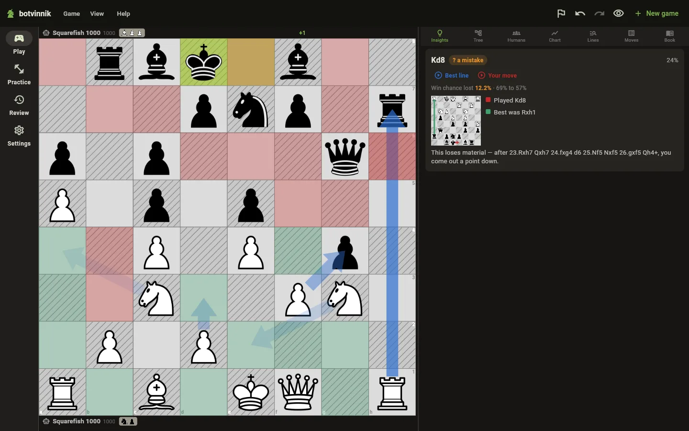
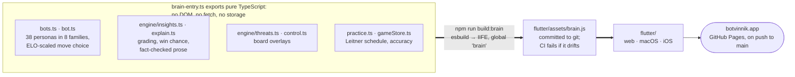

# Botvinnik

A personal chess practice app — play a bot that is weak in a human way, get
every move graded and *explained*, collect your mistakes, and drill them as
puzzles. There is no account, no API key, and nothing about your games leaves
the device unless you switch on sync (which encrypts before it does).

Live at [botvinnik.app](https://botvinnik.app). The same Flutter codebase
builds for macOS and iOS; **Linux and Windows are the PWA** — install the site
— because `flutter_js` gives those platforms a QuickJS with no BigInt, which
`brain.js` cannot even parse (see ROADMAP; #46).

<p align="center">
  <br>
  <em>More in <a href="docs/screenshots/">docs/screenshots/</a> — captured by
  <a href="scripts/screenshots/capture.mts"><code>npm run shots</code></a>,
  from a staged profile, never a real one.</em>
</p>

It began as a SvelteKit app distilled from a fork of
[en-croissant](https://github.com/franciscoBSalgueiro/en-croissant). That app
shipped the site until 2026-07-19 and was retired on 2026-07-20 — it is
preserved whole at the [`svelte-eol`](../../releases/tag/svelte-eol) tag, and
what survived it is `brain/`.

## Features

- **Engine analysis** — Stockfish at MultiPV 5: a WASM worker on the web, FFI
  on iOS, a spawned process on macOS
- **Move insights** — every move graded against the engine's best: eval,
  %-of-best, win-chance delta, chess.com-style labels (brilliant → blunder),
  and prose built only from *detected* facts — mates, hanging pieces, forks,
  pins, material over a quoted line. A claim that no longer holds is rewritten
  or dropped on load rather than shown
- **Board overlays** — engine arrows, a threat arrow with red rings on what
  that threat wins, blue rings in the arrows' own colour on what *your* line
  wins, and a square-control wash graded by how much the exchange is worth
  (green your squares, red theirs). One glyph per square, by a precedence rule
  (`board_pane.dart`): rings and arrowheads outrank the control ring, so the
  board never draws two facts on one piece
- **Lines Tree** — the game-long graph of every line the engine explored, with
  past alternatives kept as ghosts
- **Practice** — moves that drop enough win chance are collected automatically
  and drilled on a Leitner schedule; fail one and it plays the punishing line
  back at you. Hints escalate — a motif, then the square, then the move. You can
  scope a session to one game's mistakes from Review
- **Bot opponents** — 35 playable personas in 7 families, 550–2500, that each
  choose a move by a genuinely different mechanism: **Squarefish** (12), full-strength
  Stockfish plus a pure-JS layer that decides which tactics that rating fails
  to see; **Stockfish** (8), the same engine under its own strength limiter;
  **Maia** (6), human-imitation nets, one policy pass, no search;
  **ChessGPT** (3), a language model over PGN movetext with no search at all;
  **Retro** (3), Go re-implementations of Turochamp 1948, Bernstein 1957 and
  Sargon 1978; **Horizon** (2), an engine with no quiescence, so it starts
  exchanges it cannot finish; **Garbo** (1), Gary Linscott's 2011 JavaScript
  engine, verbatim. **32 play on the web** (ChessGPT needs native onnxruntime),
  **26 on iOS Safari** (Maia's runtime will not fit beside Flutter's under
  mobile Safari's memory ceiling), all 35 on macOS and iOS natively. See
  [ARCHITECTURE.md](ARCHITECTURE.md#where-each-persona-gets-its-move)
- **A stand-in badge** — when a persona's own engine cannot answer, Stockfish
  moves for it at that persona's rating, and the game says so: an amber
  `stand-in` pill on the plate, "won with help" in the archive, and the game
  dropped from the rating fit entirely. A silent substitute would corrupt the
  measurement, so it is never silent
- **Human move popularity** — for the position on the board, how often real
  players at each rating from 600 to 2600 pick each move (Maia-3), either
  looking forward or back at what you just played
- **Opening book, offline** — the named opening plus move popularity and
  results, counted from a lichess database dump and baked into the app; no
  lichess call at runtime
- **Refuse blunders** — opt in per game and a move that loses more than your
  threshold is handed back before it commits, to retry in place
- **Rated games** — played blind with the overlays off, optionally on a clock,
  fitting your own Elo by maximum likelihood against bots whose ratings are
  fixed measurements (only you float). A takeback, a hint or a stand-in takes
  the game out of the fit; the archive marks clean wins with a solid crown and
  helped ones with an outline that names the help
- **Review** — a full analysis board over the archive: step through the game
  with its stored grades, branch into a variation and come back, with a
  win-chance curve, per-side accuracy (lichess's algorithm) and label counts
- **Import** — paste a PGN, or pull a username's games from **lichess** (which
  arrive with the server's own analysis, so the mistakes reach Practice without
  the engine running once) or **chess.com** (ungraded; a background grader fills
  them in)
- **Private sync** — optional, no account: type the same phrase on two devices
  and the archive and practice queue converge through an encrypted blob the
  server cannot read or enumerate
- **Custom engines** — a catalogue of nine UCI engines installed from their
  release assets and checked against a pinned SHA-256, several with named
  playing styles; their games count toward your rating. The code supports every
  desktop platform, but macOS is the only one scaffolded today
  (`docs/desktop.md`), and a browser cannot spawn a binary at all
- **Blind mode**, start-from-FEN, backup/restore as one JSON file, and keyboard
  shortcuts throughout — the list is under the keyboard icon on a wide window,
  or Help → Keyboard shortcuts

See [ROADMAP.md](ROADMAP.md) for the load-bearing design invariants and
[CHANGELOG.md](CHANGELOG.md) for what has landed.

## Layout

One app, one brain — and a brain that is deliberately separable from it.


```mermaid
flowchart LR
    subgraph BRAIN["brain-entry.ts exports pure TypeScript:<br/>no DOM, no fetch, no storage"]
        R["bots.ts · bot.ts<br/>38 personas in 8 families,<br/>ELO-scaled move choice"]
        G["engine/insights.ts · explain.ts<br/>grading, win chance,<br/>fact-checked prose"]
        O["engine/threats.ts · control.ts<br/>board overlays"]
        P["practice.ts · gameStore.ts<br/>Leitner schedule, accuracy"]
    end

    BRAIN ==>|"npm run build:brain<br/>esbuild → IIFE, global 'brain'"| BUNDLE["flutter/assets/brain.js<br/>committed to git;<br/>CI fails if it drifts"]
    BUNDLE ==> FLUTTER["flutter/<br/>web · macOS · iOS"]
    FLUTTER --> WEB(["botvinnik.app<br/>GitHub Pages, on push to main"])
```

The roster is 38 in the brain and 35 anywhere you can play: Dala is
`nativeOnly` *and* unimplemented — it wants an lc0 sidecar nobody has built
(#45) — so `playable_families.dart` leaves it out on its own terms rather than
letting it ride a flag that means something else.

**[ARCHITECTURE.md](ARCHITECTURE.md)** is the full map: which engine backs each
persona and where its weights come from, which Stockfish runs on which
platform, how the brain crosses into Dart, and what a single move does
end to end.

```
brain/      the shared truth: bot move selection, grading, explanations,
            practice scheduling — plain TypeScript, no framework. The app
            bundles it to flutter/assets/brain.js (npm run build:brain) and
            runs it in an embedded JS engine. The purity is a property of
            brain-entry.ts, not of the directory: a few Svelte-era modules
            still touch fetch and localStorage, and are deliberately left
            unexported, because JavaScriptCore has no fetch at all and a
            native call would throw rather than fail.
flutter/    the app — web, macOS, iOS
vendor/     third-party code we carry: the Stockfish WASM build, the retro
            engines (vendor/retro/BUILD.txt pins the revision), Garbochess,
            and our dartchess fork (vendor/dartchess/FORK.md)
worker/     the sync blob store: a small Cloudflare Worker over R2 that only
            ever sees ciphertext. Deployed by hand, not by CI
scripts/    tooling and research: the brain bundle, golden fixtures, the
            calibration gym, the SquareFish lichess bot, the screenshot capture
docs/       submission notes, desktop notes, design decisions, screenshots
design/     source art for the icons
```

## Using it

**Any browser** — open [botvinnik.app](https://botvinnik.app) and install it
from the address bar if you want it in its own window. It is a real offline
PWA: a content-hashed service worker precaches the shell and fills the rest on
first use, with the vendored engines in a second cache that a deploy does not
evict.

**macOS and iOS** — build it yourself (below). There is no published binary for
the Flutter app: the only release here, `v0.1.0`, predates the platform split
and is the retired Tauri build. The App Store work is done in code and blocked
on an Apple account — see [docs/app-store/](docs/app-store/README.md).

## Development

```sh
npm install          # the brain's toolchain
npm run check        # type-check brain/ and scripts/
npm test             # the brain's unit tests, plus the service-worker generator
npm run build:brain  # rebuild flutter/assets/brain.js (CI fails if it drifts)

cd flutter
./stage-web-assets.sh && flutter run -d chrome   # web, and the only hot reload
./serve-web.sh                                   # a release build on :8792
flutter run -d macos                             # macOS
flutter test                                     # the Dart unit and widget tests
```

Use `./build-web.sh`, never a bare `flutter build web`: the service worker's
precache manifest is generated from the built output, so a raw build ships a
worker whose placeholder was never substituted.

The rest of the suites, and what each one is for, are in
[ROADMAP.md](ROADMAP.md#design-notes--known-quirks) — including
`npm run test:e2e:flutter` (Playwright against the real built app) and the
integration tests that need a device because they are the only thing that
exercises the real JavaScriptCore bridge.

`npm run shots` ([`run.sh`](scripts/screenshots/run.sh) builds and serves,
[`capture.mts`](scripts/screenshots/capture.mts) drives) rewrites
[docs/screenshots/](docs/screenshots/) from a fresh browser profile per shot,
staging a bot-vs-bot game and a synthetic practice queue so no picture can
contain anyone's real data.

`flutter/README.md` covers the app itself, including the native engine staging
scripts for macOS and iOS.

## Deploy

Pushes to `main` deploy `flutter/build/web` to GitHub Pages via
[`.github/workflows/pages.yml`](.github/workflows/pages.yml). Work lands on
`develop` first; only a `develop → main` merge deploys. The sync Worker is
deployed separately and by hand, from `worker/`.

## What leaves the device

Nothing, by default — and every exception is one you asked for:

| | When |
|---|---|
| **huggingface.co** | you pick a Maia; its net is fetched once and cached |
| **raw.githubusercontent.com** | you open the Humans panel — the Maia-3 net, from the CSSLab repo |
| **github.com** | you install a catalogue engine or a ChessGPT net — release assets from each engine's own upstream (seven orgs; `engine_catalog.dart`), every one checked against a pinned SHA-256. Desktop and native only |
| **lichess.org / api.chess.com** | you import a username's games |
| **the sync Worker** | you turn sync on. It stores one AES-256-GCM blob under an id derived from your phrase, so it can neither read your games nor enumerate whose they are |

There is no account, no analytics, and no third-party request on a plain visit.
Games, practice items and settings live in sqflite and `shared_preferences` on
the device.
